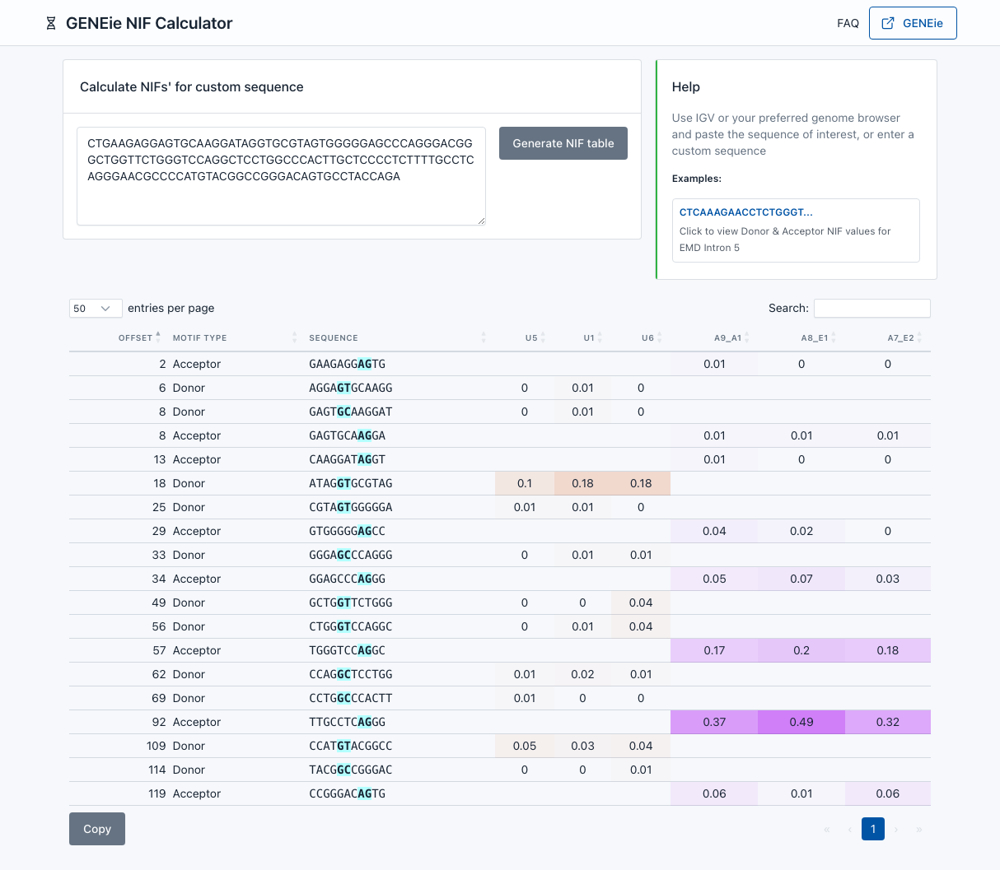

# GENEie NIF calculator

NIF calculator (See GENEie paper: [doi.org/TBC](doi.org/TBC)) is a simple online tool where you can paste a nucleotide sequence and easily calculate the Donor and Acceptor motif Native Intron Frequency (NIF) values.

NIF calculator demonstrates the core foundation of GENEie in an easy to use visual format.

[Click here to access NIF Calculator](https://nifcalc.frontiergenomics.com.au)

## What is Native Intron Frequency (NIF)?

A splice-site can be divided into overlapping windows of 9-nucleotides (nt) to measure splicesite strength based on how commonly the 9-nt sequence occurs at a given position of the exon-intron junction among all annotated human splice-sites; A measure defined as Native Intron Frequency or NIF.

## Which reference and assembly is Native Intron Frequency (NIF) based on?

* Ensembl Release 110
* GRCh38

## What is GENEie?

GENEie® is the first evidence-based Clinical Decision Support software developed for accurate, confident, clinical interpretation of extended splice-site variants. Designed specifically for use in genetic pathology, GENEie empowers clinical decision making by producing ACMG-aligned clinical evidence that supports variant-disease association.

Fundamentally distinct from ‘black box’ predictive metrics, GENEie® intelligent evidence embodies pathology reasoning and the search for meaningful clinical evidence, reporting all source evidence for expert scrutiny.

GENEie® evidence has potential to enable vastly more Extended Splice Site variants to be accurately classified and provides a pragmatic triage for RNA sequencing with predictable, high, diagnostic return.

[Click here to access GENEie®](https://geneie.frontiergenomics.com.au)

## How to run NIF calculator locally?

### Pre requisites
* [VSCode](https://code.visualstudio.com)
* Mac or Windows
* Safari, Chrome, Firefox or Microsoft Edge (Other browses may also work)
* Optimised for Desktop

### Steps
1. Install VSCode
2. Git clone this repository
3. Open this in VSCode
4. Reopen this project in a Dev Container. This will ensure all required dependencies are automatically installed.
5. Open VSCode's [Run and Debug](https://code.visualstudio.com/docs/editor/debugging) view
6. Run 'Python: Flask' launch configuration
7. Now you can access NIF calculator locally on http://127.0.0.1:5001

## How does NIF calculator work?

* [nif_calculator/resources/sj_stats.sqlite](nif_calculator/resources/sj_stats.sqlite) contains pre-computed Native Intron Frequency (NIF) values for Donor and Acceptor sequences. (See GENEie paper: [doi.org/TBC](doi.org/TBC) for an in depth understanding of NIF and the sequence windows used by GENEie)).
* An arbitrary sequence can be pasted into the search box.
* After clicking "Generate NIF table", the sequence is scanned for Donor and Acceptor motifs.
* Each motif is broken up into 9 nt wide sequences and the NIF value is obtained for each sequence from the aformentioned pre-computed values.
* For each motif, the sequence along with the NIF values are displayed in a tabular formar.

## How can I use NIF calculator?

* This screenshot depicts the NIF calculator output for an example sequence.
* The example sequence is for EMD Intron 5.
* The table displays all the discovered Donor and Acceptor motifs, along with their NIF values.
* If you are analysing genetic variants (intronic or exonic), you may use the NIF calculator to analyse the REF and VAR motifs in order to determine if the variant creates a cryptic splice-site.
* Reading (See GENEie paper: [doi.org/TBC](doi.org/TBC) is strongly recommended to gain a comprehensive understanding of NIF. 

